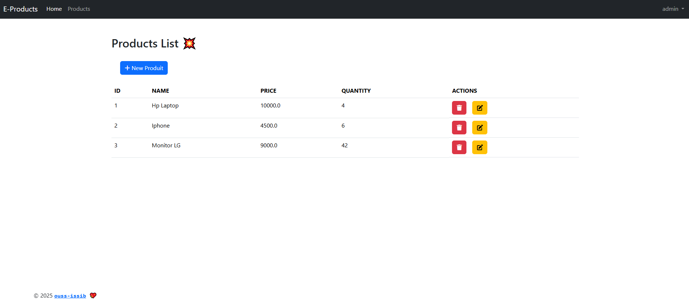

# Activité Pratique d'une application Web Spring MVC

Ce dépôt contient une implémentation pratique d'une application web utilisant **Spring MVC**, **Thymeleaf** et **Spring Security**. Cette activité s'inscrit dans le cadre du cours de **Java JEE** encadré par **Mr YOUSSFI Mohamed**.

## Aperçu de l'application

### Application Web `Spring MVC`

- **Objectif** : Développer une application web sécurisée avec gestion des utilisateurs, authentification, et autorisation.
- **Technologies utilisées** :
  - `Spring MVC` pour le modèle de conception MVC.
  - `Thymeleaf` pour les vues HTML dynamiques.
  - `Spring Security` pour la gestion de la sécurité.
  - `Spring Boot` pour la configuration et le démarrage simplifiés.

- **Fonctionnalités principales** :
  1. Authentification via un formulaire de connexion sécurisé.
  2. Autorisation basée sur les rôles (`USER`, `ADMIN`).
  3. Interface utilisateur dynamique avec Thymeleaf.
  4. Accès restreint à certaines pages selon les rôles.
  5. CRUD des produits (pour les admins).
  6. Pages d’erreur personnalisées (`/access-denied`, etc.).

## Captures d'écran

| Page de connexion | Home Page |Tableau de bord utilisateur | Tableau de bord utilisateur (admin) |
|---|---|---|---|
|  |  |  |  |

| Ajouter un produit | Supprimer un Produit | Modifier un Produit | Chercher un Produit par son nom |
|---|---|---|---|
|  |  |  |  | 

| Validation avant l'ajout du produit| Validation avant la modification du produit |
|---|---|
|  |  |

---

## Comment Exécuter

1. **Informations de connexion :**  
   - Utilisateur : `user1`, mot de passe : `123321`
   - Utilisateur : `user2`, mot de passe : `123321`  
   - Admin : `admin`, mot de passe : `123321`
     
2. Cloner le dépôt :
   ```bash
   git clone https://github.com/ouss-issib/spring-mvc-thymeleaf-security.git

3. Naviguer dans le répertoire du dépôt :
   ```bash
   cd spring-mvc-thymeleaf-security

4. Compiler et exécuter les fichiers Java :
   ```bash
    mvn clean install
    mvn spring-boot:run

5. Accéder à l'application :
    http://localhost:9090
